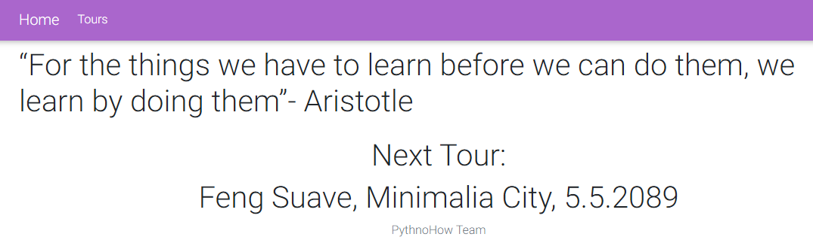
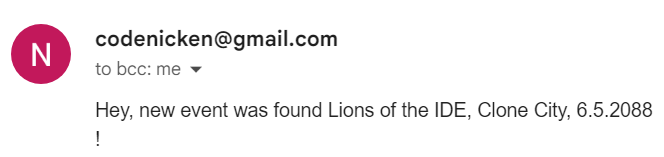
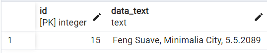

# Build a Music Event Web Scraper Using Python

## Project Description

**Overview :**  
The Music Event Web Scraper is a Python-based application designed to monitor a website for upcoming music events, retrieve relevant information, and provide notifications via email. Additionally, the scraped data is stored in a SQL database for further analysis and historical reference.

**Challenges :**  
Build a Music Event Web Scraper Using Python.

## Project Goal

The project aims to get notification via email when there is upcoming music event.

## Tools & Library Used

 &nbsp;

## Project Result

[Click here to get full code](https://github.com/nickenshidqia/Build_a_Music_Event_Web_Scraper_Using_Python/blob/08ed9ed3d8cc6d91c2e64b01592f0c533ebe1c92/main_sql2.py)

### Web Scraping:

- Utilize web scraping techniques to extract information about upcoming music events from a specified website  
    

### Email Notifications:

- Implement an email notification system to alert users when new music events are detected.  
    

### SQL Database Integration:

- Establish a SQL database to store the scraped data.  
  
